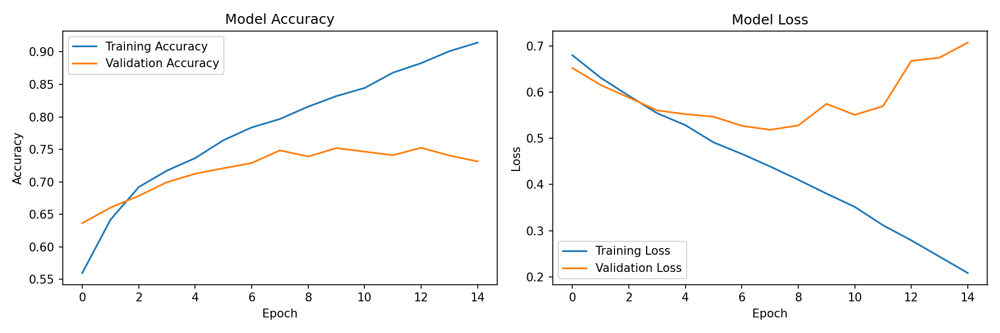
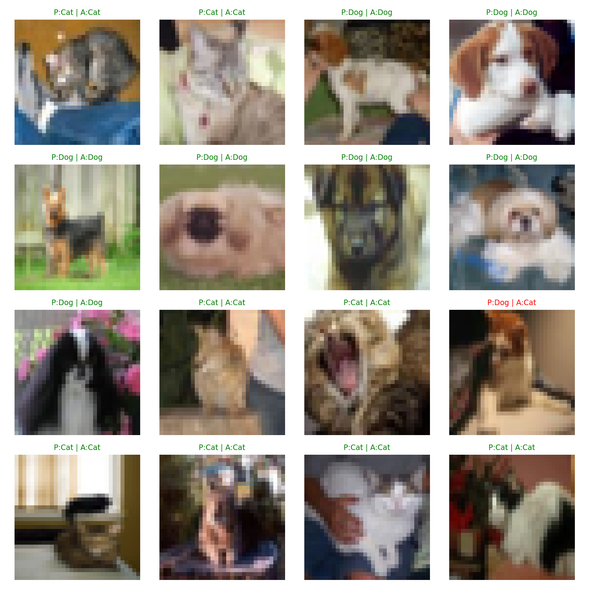
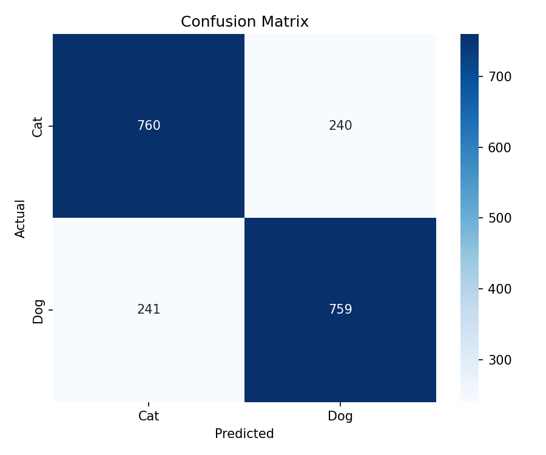

# 🐱🐶 Cat vs Dog CNN Classifier

A Convolutional Neural Network (CNN) that classifies images of cats and dogs using TensorFlow/Keras, trained on the CIFAR-10 dataset.

## 📌 Project Overview

This project builds a deep learning image classifier from scratch to distinguish between cats and dogs. It demonstrates the full machine learning pipeline: data preprocessing, model architecture design, training, evaluation, and visualization.

## 🧠 How It Works

1. **Data Loading** — Loads the CIFAR-10 dataset (60,000 images across 10 categories)
2. **Data Filtering** — Extracts only cat and dog images (10,000 training / 2,000 test)
3. **Preprocessing** — Normalizes pixel values from 0-255 to 0-1 for optimal training
4. **Model Building** — Constructs a CNN with 3 convolutional layers, max pooling, dropout, and dense layers
5. **Training** — Trains the model for 15 epochs with 80/20 train/validation split
6. **Evaluation** — Tests on unseen data and generates performance metrics

## 🏗️ Model Architecture

| Layer | Type | Details |
|-------|------|---------|
| 1 | Conv2D | 32 filters, 3x3, ReLU |
| 2 | MaxPooling2D | 2x2 |
| 3 | Conv2D | 64 filters, 3x3, ReLU |
| 4 | MaxPooling2D | 2x2 |
| 5 | Conv2D | 64 filters, 3x3, ReLU |
| 6 | Flatten | — |
| 7 | Dense | 64 neurons, ReLU |
| 8 | Dropout | 0.5 |
| 9 | Dense (Output) | 1 neuron, Sigmoid |

## 📊 Results

- **Test Accuracy: ~76%**
- Balanced precision and recall for both classes

### Training History


### Sample Predictions


### Confusion Matrix


## 🛠️ Technologies Used

- Python 3.11
- TensorFlow / Keras
- NumPy
- Matplotlib
- Scikit-learn
- Seaborn

## 🚀 How to Run

```bash
